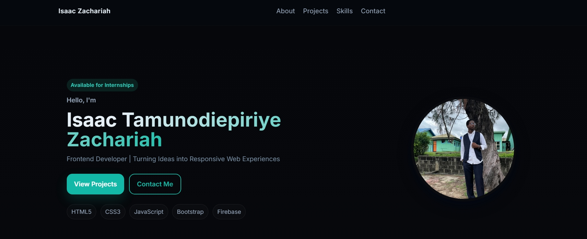

# Isaac Zachariah Portfolio



## Live Website

**Portfolio:** https://isaacportfolioo.netlify.app

---

## About

This is my personal portfolio website showcasing my skills, projects, and experience as a Frontend Developer. The website was designed with a modern, responsive, and user-friendly interface to provide recruiters and potential clients with an overview of my work.

---

## Features

- Responsive design for all devices
- Modern dark-themed UI
- About Me section
- Skills section
- Featured Projects
- Contact form powered by Formspree
- Download CV
- GitHub and LinkedIn integration
- Smooth scrolling and animations

---

## Built With

- HTML5
- CSS3
- JavaScript (ES6)
- Bootstrap
- Formspree

---

## Featured Projects

- Eko Heritage Restaurant
- Luxury Hair Empire
- Green Valley University
- Birthday Website
- Shipping Website
- Countdown Timer

Each project includes GitHub repository links, and deployed projects also include live demo links.

---

## Installation

Clone the repository:

```bash
git clone https://github.com/isaacbuildsgood/Portfolio-Website.git
```

Open the project folder and launch `index.html` in your browser.

---

## Contact

Email: isaacdblessed4jesus@gmail.com

LinkedIn:
https://www.linkedin.com/in/isaac-zachariah-036a01400

GitHub:
https://github.com/isaacbuildsgood

Portfolio:
https://isaacportfolioo.netlify.app

---

## License

This project is open source and available under the MIT License.
